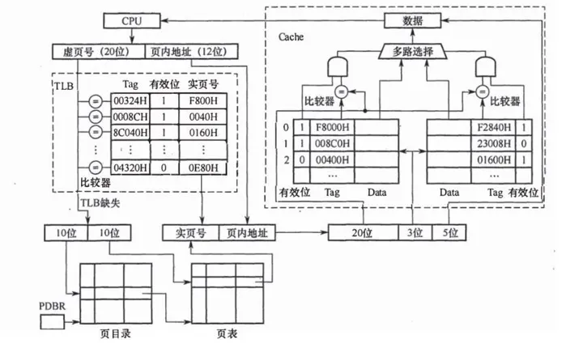

# 内存管理与Cache

借用 18、23 年组原大题举例

某计算机采用页式虚拟存储管理方式，按字节编址。CPU进行存储访问的过程如图所示。


先整理一下由图可知的信息：

- 虚拟地址位数为 32 位
- TLB
  - 虚拟地址高 20 位为 Tag
  - 实页号（页框号）为 12 位
  -
- PageTable
- Cache
  - 二路组相联映射
  - 有 $2^3=8$ 组
  - 共有 $2\times8=16$ 行 Cache 行
  - 主存块大小为 $2^5B=32B$，同时 Cache 数据区等大

## Cache

- Cache 容量
- cache 行格式
- 命中率
- 计算 cache 组号/行号
- 比较器
- 指令 Cache 与数据 Cache 分离

### Cache 行内容

Cache 行通常包含以下内容：

- Tag 标记
- 有效位
- 数据区

在写策略采用写回法时，增加一位脏位（修改位）标识 Cache 数据是否被更改。

在替换算法使用 LRU 算法时，增加几位用于实现计数器。

Cache 行数据部分大小通常与主存块一致，多个主存块组成页。

$Cache 总大小 =Cache 行大小\times Cache行数$。

$Cache 行大小 = Tag位+有效位(1)+主存块大小+脏位(1)+LRU位$

$Cache 数据区大小=Cache 行数\times 主存块大小$

### Cache 映射

Cache 有三种映射方式

- 直接映射
- 全相联映射
- 组相联映射

主存地址通过映射划分为不同的部分。虚存地址需要先通过 TLB 或页表转换为主存地址再进行映射。

主存地址的划分中，只有 Tag 部分是直接显示在 Cache 行中的。此处忽略了写策略与替换算法需要的位。

直接映射：
$$
\begin{aligned}
主存地址 & = |Tag|行号|块内地址| \\
Cache[行号] & = |Tag|有效位|数据|\\
\end{aligned}
$$

全相联映射：
$$
\begin{aligned}
主存地址 & = |Tag|块内地址| \\
每行Cache行 & = |Tag|有效位|数据|\\
\end{aligned}
$$

组相联映射：
$$
\begin{aligned}
主存地址 & = |Tag|组号|块内地址| \\
Cache[组号] & \\
组里的每行Cache行 & = |Tag|有效位|数据| \\
\end{aligned}
$$

由划分方式可知，Tag 标记即为主存地址高位部分。

在组/全相联映射中，在硬件上通过多个比较器来实现组内多个 Cache 行快速比较 Tag 标记，则 $比较器数量=组内Cache行数量$。

### Cache 替换算法

- 随机替换
- LRU
- LFU
- FIFO

| 名称     | 全称                  | 意义                                          | 位数                   |
| -------- | --------------------- | --------------------------------------------- | ---------------------- |
| 随机替换 |                       | 随机选一个 Cache 行替换出去                   | -                      |
| LRU      | Least recently used   | 根据计数器，选出最近最久未访问的 Cache 行替换 | $\lceil\log_{2}{n}\rceil$  |
| LFU      | Least frequently used | 根据计数器，选出最不常用的 Cache 行替换       | 根据策略决定计数器位数 |
| FIFO     |                       | 先进入的 Cache 先被替换出去                   | $\lceil\log_{2}{n}\rceil$  |

对于不同的映射方式，$n$ 的选取有所不同
$$
n=
\begin{cases}
Cache行数&直接映射 or全相联映射 \\
Cache组内行数&组相联映射\\
\end{cases}
$$

### Cache 命中率

在题目给出二维数组时，通常会要求计算 Cache 命中率。

````ad-example
已知计算机M字长为32位，按字节编址，采用请求调页策略的虚拟存储管理方式，虚拟地址为32位，页面大小为4KB；数据Cache采用4路组相联映射，数据区大小为8KB，主存块大小为32B。现有C语言程序段如下：

```c
for (i = 0; i < 24; i++)
    for (j = 0; j < 64; j++) 
        a[i][j] = 10;
```
已知二维数组a按行优先存放，在虚拟地址空间中分配的起始地址为0042 2000H，sizeof(int)=4，假定在M上执行上述程序段之前数组a不在主存，且在该程序段执行过程中不会发生页面置换。
````

主存块大小为 $32B$，int 类型数据 $4B$，一块主存可以存放 $\frac{32B}{4B}=8$ 个 int 类型数据。

由于数组 a 不在主存，可知 Cache 中不存在数组 a 的缓存。数组 a 按行优先存放，观察程序段可知每个数组只访问一次。那么访问第一个元素时发生 Cache 缺失，从内存中将主存块数据调入 Cache，则接下来 7 次访问都名字。故命中率为 $\frac{7}{8}=87.5\%$。

```c
for (j = 0; j < 60; i++)
    for (i = 0; i < 24; j++) 
        a[i][j] = 10;
```

调换之后，按先入为主的思维可能会认为 Cache 命中率为 $0\%$，实则不然。

考虑 Cache 数据区大小为 $8KB$，数组 a 大小为 $24\times60\times4B=5760B$$=5KB+640B$，可以全部调入 Cache 中。

接下来考虑数组 a 映射时，调入的主存块访问几次后被调出，或不被调出。

数组 a 的起始地址为 0042 2000H，取低 12 位 000H 为页内地址。经过计算 $A0\sim A4$ 为块内地址，$A5\sim A10$ 为 Cache 组号。

| 数组      | 地址         | Cache 组号（二进制） | Cache 组号 |
| --------- | ------------ | -------------------- | ---------- |
| $a[0][0]$ | $0042~2000H$ | 000000               | 0          |
| $a[1][0]$ | $0042~2100H$ | 001000               | 8          |
| $a[2][0]$ | $0042~2200H$ | 010000               | 16         |
| $a[3][0]$ | $0042~2300H$ | 011000               | 24         |
| $a[4][0]$ | $0042~2400H$ | 100000               | 32         |
| $a[5][0]$ | $0042~2500H$ | 101000               | 40         |
| $a[6][0]$ | $0042~2600H$ | 110000               | 48         |
| $a[7][0]$ | $0042~2700H$ | 111000               | 56         |
| $a[8][0]$ | $0042~3000H$ | 000000               | 0          |
| $a[9][0]$ | $0042~3100H$ | 001000               | 8          |
| $a[10][0]$ | $0042~3200H$ | 010000               | 16         |
| $a[11][0]$ | $0042~3300H$ | 011000               | 24         |
| $a[12][0]$ | $0042~3400H$ | 100000               | 32         |
| $a[13][0]$ | $0042~3500H$ | 101000               | 40         |
| $a[14][0]$ | $0042~3600H$ | 110000               | 48         |
| $a[15][0]$ | $0042~3700H$ | 111000               | 56         |
| $a[16][0]$ | $0042~4000H$ | 000000               | 0          |
| $a[17][0]$ | $0042~4100H$ | 001000               | 8          |
| $a[18][0]$ | $0042~4200H$ | 010000               | 16         |
| $a[19][0]$ | $0042~4300H$ | 011000               | 24         |
| $a[20][0]$ | $0042~4400H$ | 100000               | 32         |
| $a[21][0]$ | $0042~4500H$ | 101000               | 40         |
| $a[22][0]$ | $0042~4600H$ | 110000               | 48         |
| $a[23][0]$ | $0042~4700H$ | 111000               | 56         |

可以看出，i 在循环 0~23 时，需要映射到同一个组里 3 个 Cache 行，而 Cache 组内有 4 行 Cache，可以满足 i 循环时，调入的块不被替换。

一个 Cache 块可以存放 8 个元素，j 在循环 0~63 时，组号的增量为 $\frac{64}{8}=8$，则 $i = 0，j = 0~to~63$ 时组号的变化为 $0~to~7$，正好满足调入的块不被替换。

则每个 Cache 块，发生 Cache 未命中时被调入，后续对该 Cache 块的 7 次访问均命中，故 Cache 命中率为 $\frac{7}{8}=87.5\%$。
