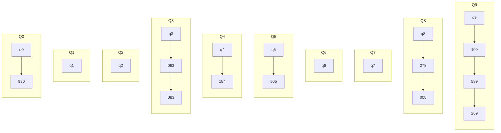
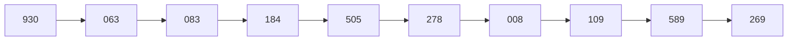
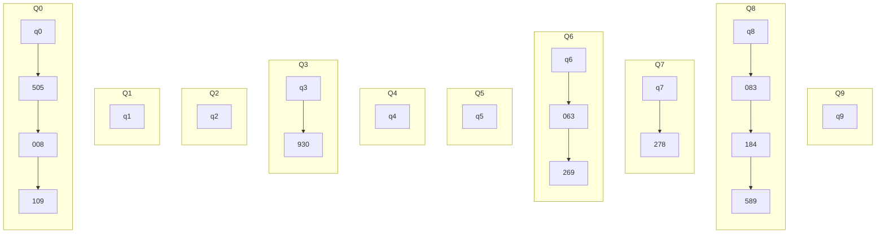
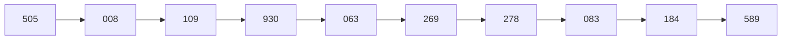
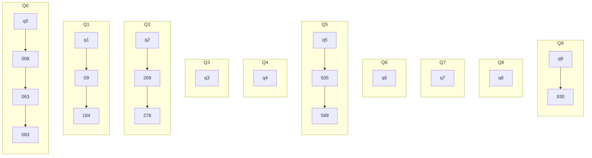
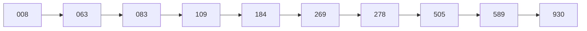

# Link

---
Previous: [10.5_归并排序](10.5_归并排序.md)

Next: [10.7_外部排序](10.7_外部排序.md)

# 基数排序

---

基数排序是一种非比较性的排序算法，将元素分解为多个关键字（如将数字按位数划分），得到该元素的关键字元组 $d$。

## 方法

基数排序的主要思想：长度为 $n$ 的线性表中每个节点 $a_j$ 有关键字元组 $d=(k_j^{d-1},k_j^{d-2},\cdot\cdot\cdot,k_j^1,k_j^0)$，其中 $k_j^i$ 满足 $0\le k_j^i\le r-1~(0\le j<n,~0\le i\le d-1)$，其中 $d$ 是位数， $r$ 是基数（桶的数量），。根据关键字进行多次分组、排序最后得到有序序列。

- LSD 最低位优先：从最次要关键字 $k_j^0$ 开始
- MSD 最高位优先：从最主要关键字 $k_j^{d-1}$ 开始

LSD 流程：

- 从最低位开始，重复 $d$ 次分配与收集
- 分配：将队列 $Q_0,Q_1,\cdot\cdot\cdot,Q_{r-1}$ 清空，遍历序列中每个结点 $a_j$，根据 $a_j$ 的关键字 $k_j^i$ 插入到对应的队列中 $Q_k$。
- 收集：将队列 $Q_0,Q_1,\cdot\cdot\cdot,Q_{r-1}$ 依次连接，得到新的序列，再对新序列进行分配。
- 重复 $d$ 次分配与收集后，基数排序完成。

对序列 $L = [278,109,063,930,589,184,505,269,008,083]$ 进行基数排序

- 第一次分配

- 第一次收集

- 第二次分配

- 第二次收集

- 第三次分配

- 第三次收集

## 性能分析

- 空间复杂度：$O(r)$，基数排序需要额外的内存来存储中间过程的“桶”
- 时间复杂度：$O(d\times(n+r))$，需要 $d$ 趟排序，每次排序需要 1 次分配 1 次收集，每次分配涉及 $n$ 个元素，收集涉及 $r$ 个队列
- 稳定性：稳定
- 适用性：顺序存储、链式存储

# Relative

---

[10.1_内部排序](10.1_内部排序.md)

# Reference

---
