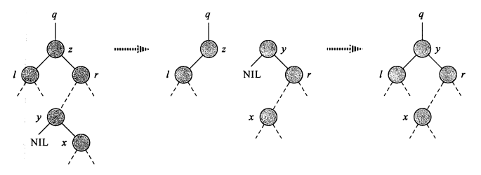

# Link

---
Previous: [9.3_分块查找](9.3_分块查找.md)

Next: [9.4.2_AVL树](9.4.2_AVL树.md)

# 二叉搜索树

---

## 定义

- 二叉搜索树也叫二叉查找树
- 二叉搜索树可以为空
- 若左子树非空，左子树上所有结点的值均小于根结点的值
- 若右子树非空，右子树上所有结点的值均大于根结点的值
- 左右子树也是二叉搜索树

## 查找

二叉搜索树从根结点开始查找，将给定的关键字 $key$ 与结点的值进行对比。相等说明查找成功；关键字 $key$ 小于结点的值，则转移到根结点的左子树，否则转移到右子树。

若转移到叶结点仍未查找成功，说明查找失败。

## 插入

若二叉搜索树为空，直接插入。

若二叉搜索树非空，对给定关键字 $key$ 进行一次查找，若查找成功无需插入；查找失败时，查找路径上最后一次访问的结点作为插入结点。关键字 $key$ 小于插入结点的值时，成为插入结点的左子；否则成为右子。

## 删除

删除结点时，根据被删除结点$z$的情况，归纳为三种情况：

1. 结点 $z$ 是叶结点
2. 结点 $z$ 只有一颗左子树或右子树
3. 结点 $z$ 有两颗子树

### 情况一

结点 $z$ 是叶结点时，直接删除。

### 情况二

结点 $z$ 只有一颗左子树或右子树。

将子树提升到结点 $z$ 的位置，由子树代替结点 $z$。

### 情况三

结点 $z$ 有两颗子树。

寻找结点 $z$ 的直接后继结点 $y$（在右子树中），用结点 $y$ 替换结点 $z$ 的位置。结点 $y$ 从结点 $z$ 的右子树中被删除（因为用于替换结点 $z$），因此对结点 $z$ 的右子树需要进行删除调整（必然为情况一或情况二）。

# Relative

---

[9.1_查找](9.1_查找.md)

# Reference

---
