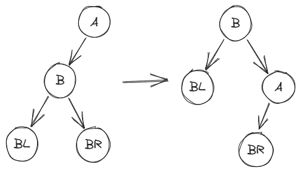
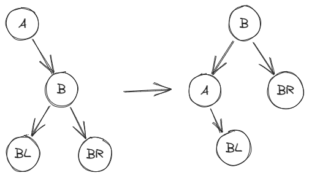
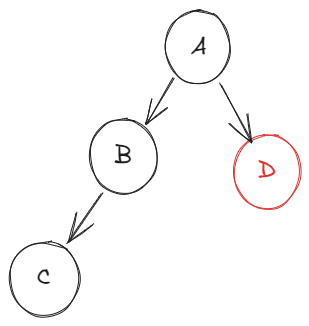
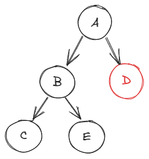
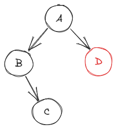
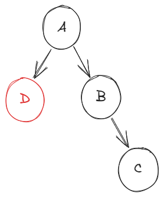
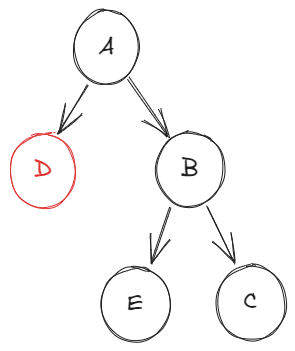
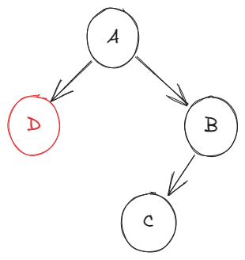

# Link

---
Previous: [9.4.1_二叉搜索树](9.4.1_二叉搜索树.md)

Next: [9.4.3_红黑树](9.4.3_红黑树.md)

# AVL树

---

## 定义

在二叉搜索树的基础上，规定任意结点的左右子树高度差不超过 1。左右子树的高度差为平衡因子，平衡因子定义为：$左子树高度-右子树高度$。

- 结点被删除再插入不一定改变 AVL 树的结构
- 结点插入再删除不一定改变 AVL 树的结构

## 插入

插入的方式与二叉搜索树一样。但是在插入结点后，导致结点 $A$ 的平衡因子绝对值大于 1 时，需要进行调整。

### 旋转

### 右旋

以结点 $A$ 为根节点进行一次右旋。

### 左旋

以结点 $A$ 为根节点进行一次右旋。

### LL 平衡旋转

在结点 $A$ 的左孩子的左子树插入结点，导致结点 $A$ 失衡。

以结点 $A$ 为根结点进行一次右旋操作。

### RR 平衡旋转

在结点 $A$ 的右孩子的右子树插入结点，导致结点 $A$ 失衡。

以结点 $A$ 为根结点进行一次左旋操作。

### LR 平衡旋转

在结点 $A$ 的左孩子结点$B$的右子树插入结点，导致结点 $A$ 失衡。

先以结点 $B$ 为根结点进行一次左旋，再以结点 $A$ 为根进行一次右旋。

### RL 平衡旋转

在结点 $A$ 的右孩子结点 $B$ 的左子树插入结点，导致结点 $A$ 失衡。

先以结点 $B$ 为根结点进行一次右旋，再以结点 $A$ 为根进行一次左旋。

## 删除

删除的方法与二叉搜索树相同，但是删除后需要从删除结点 $w$ 向上回溯查看是否有结点的平衡被破坏。

对于不平衡结点 $A$，有如下几种情况：

使用红色标注被删除结点。

- 情况一：相当于 LL 型

- 情况二：相当于 LR 型

- 情况三：相当于 RR 型

- 情况四：相当于 RL 型

# Relative

---

[9.1_查找](9.1_查找.md)

# Reference

---
