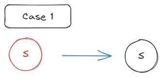
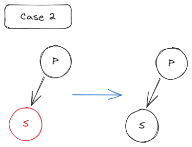
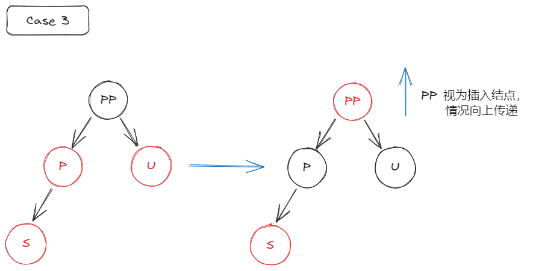
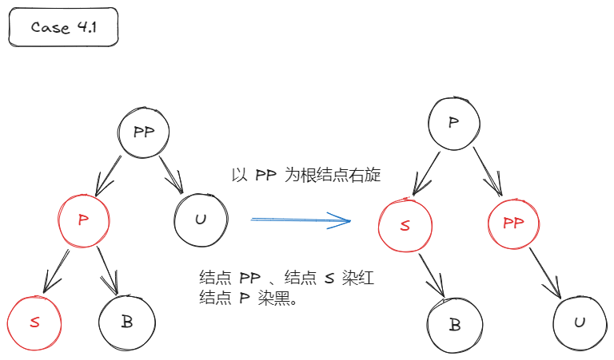
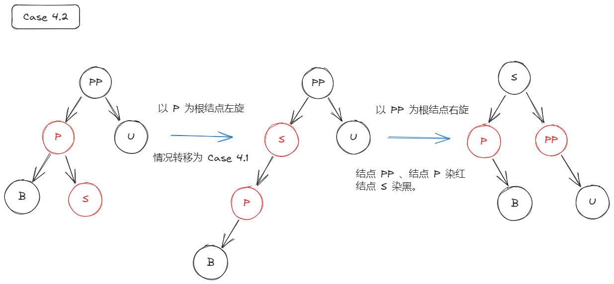

# Link

---
Previous: [9.4.2_AVL树](9.4.2_AVL树.md)

Next: [9.4.4_B树](9.4.4_B树.md)

# 红黑树

---

## 定义

基于 AVL 树，放宽条件以此减少插入删除操作的频繁程度。

- 根结点是黑色
- 叶节点是黑色
- 所有路径上黑色结点数量一致
  - 去掉红色结点，黑色结点形成满二叉树
  - 根结点到叶结点的最长路径不大于最短路径的两倍（极端最短：全黑；极端最长：黑红交错）
  - $n$ 个内部结点的红黑树高度 $h\le 2log_2{(n+1)}$
- 红色结点不能相邻
  - 两个黑色结点之间只能插入一个红色结点
- 空指针也是黑色结点，视为黑色叶结点
- 插入结点总是红色，调整过程中根据情况是否变色

## 插入

### 情况 1

红黑树为空树。

直接插入，插入结点 $S$ 染黑。

### 情况 2

父结点 $P$ 为黑色。

直接插入，插入节点 $S$ 不改变状态。

### 情况 3

父结点 $P$ 是红色，叔结点 $U$ 是红色。

插入后，插入结点 $S$ 不改变状态，父结点 $P$ 与叔结点由染黑，祖父结点 $PP$ 染红。情况向上传递，即将祖父结点 $PP$ 视为插入结点。

### 情况 4

父结点 $P$ 是红色，叔结点 $U$ 是黑色（可能为空结点）。

#### 情况 4.1

- LL 型插入：以祖父结点 $PP$ 为根结点**右旋**一次，原祖父结点 $PP$ 与插入结点 $S$ 染红，原父节点 $P$ 染黑。

- LR 型插入：以父结点 $P$ 为根结点**左旋**一次，将原父结点 $P$ 视为插入结点。情况转移为 LL 型插入。

- RR 型插入：以祖父结点 $PP$ 为根结点**左旋**一次，原祖父结点 $PP$ 与插入结点 $S$ 染红，原父节点 $P$ 染黑。
- RL 型插入：以父结点 $P$ 为根结点**右旋**一次，将原父结点 $P$ 视为插入结点。情况转移为 RR 型插入。

## 删除

太多了，放过它吧。

有空再整理。

# Relative

---

[9.1_查找](9.1_查找.md)

# Reference

---
