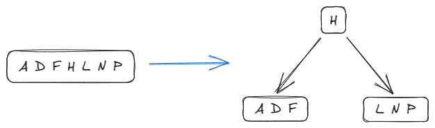
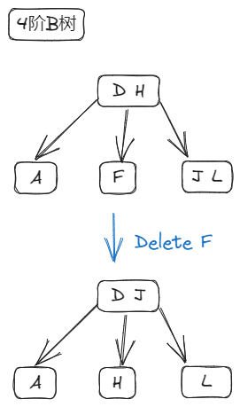
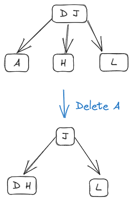

# Link

---
Previous: [9.4.3_红黑树](9.4.3_红黑树.md)

Next: [9.5_Hash表](9.5_Hash表.md)

# B树

---

## 定义

一颗 m 阶 B 树，满足如下特性：

- 内部结点有以下信息：
  - $x.n$ 表示关键字个数
  - $n$ 个关键字 $x.key_i$ 表示关键字，以非降序存放：$$x.key_1\le x.key_2\le \cdot\cdot\cdot\le x.key_{x.n}$$
  - $x.leaf$ 是否为叶结点（外部结点）
  - $x.c_i$ 指向其孩子的指针
- 如果根结点不是叶结点，则至少有两颗子树
- 内部结点至多包含 $m-1$ 个关键字，$m$ 棵子树
- 内部结点至少包含 $\lceil \frac{m}{2}\rceil - 1$ 个关键字， $\lceil \frac{m}{2}\rceil$ 棵子树
- 通过关键字 $x.key_i$ 对存储在子树中的关键字范围进行分割：$k_i$ 表示以 $x.c_i$ 为根的子树中的任意关键字，且按升序排序 $$k_1\le x.key_1\le k_2\le x.key_2\le\cdot\cdot\cdot\le k_n\le x.key_n\le k_{n+1}$$
- 每个叶结点（外部结点）高度 $h$ 相等

### 高度

- B 树的高度不包括叶结点。

对于包含 $n$ 个关键字、高度为 $h$ 的 $m$ 阶 B 树：
$$
\log_{m}{n+1}\le h\le\log_{\lceil\frac{m}{2}\rceil}\frac{n+1}{2}+1
$$

## 查找

B 树的查找包含两个操作：

- 在 B 树中查找结点
- 在结点中寻找关键字

在 B 树上查找到某个节点后，将结点读入内存，再在结点内寻找关键字。如果找到关键字表示查找成功，否则根据查找关键字与结点关键字查找下一个可能的结点。如果查找到叶结点说明查找失败。

### 分裂

要分裂一个结点，这个结点一定是满关键字的。

提取 $\lceil\frac{m}{2}\rceil$ 位置的关键字，提升到父结点中，然后把原结点的关键字分为 $x.key_{\lceil\frac{m}{2}\rceil}$ 左侧和右侧两个区间。将右侧区间提取为一个新的内部结点，父结点中对应的 $x.c_i$ 指针执行该结点。

## 插入

插入涉及到 B 树结点的分裂操作。

要在 B 树插入一个新的关键字时，先通过查找得到查找失败的位置。查找失败时，最后会指向一个叶结点，这个叶结点的父节点即为插入位置。

- 结点关键字数 $x.n \le m-1$，将关键字插入该结点
- 结点关键字数 $x.n = m$，进行分裂处理。分裂会导致向上传递插入操作，即分裂时 $\lceil\frac{m}{2}\rceil$ 处的关键字会插入到父结点。

## 删除

删除涉及到 B 树结点的合并操作。

### 情况一

m 阶 B 树的结点删除关键字后，结点内关键字个数 $x.n$ 仍满足 $\lceil\frac{m}{2}\rceil-1\le x.n\le m-1$，则不需要调整。

### 情况二

m 阶 B 树的结点删除关键字后，结点内关键字个数  $x.n<\lceil\frac{m}{2}\rceil-1$。

#### 情况 2.1

左右相邻结点内关键字个数 $x.n$ 满足 $x.n\ge \lceil\frac{m}{2}\rceil$（这样相邻结点失去一个关键字后仍然满足 m 阶 B 树定义）。

- 从右侧相邻结点借关键字

从结点 $z$ 中删除关键字 $k_i$ 后，将父结点中关键字 $p.key_{i+1}$ 移入结点 $z$，再从右侧相邻结点 $r$ 中选择关键字 $z.key_1$ 移入父节点。

- 左侧情况类似

#### 情况 2.2

左右相邻结点内关键字个数 $x.n$ 不满足 $x.n\ge \lceil\frac{m}{2}\rceil$ 时，需要进行合并处理。

此时将结点 $z$ 的关键字 $k_i$ 删除后，结点 $z$ 的关键字数量不满足 $z.n \ge \lceil\frac{m}{2}\rceil-1$，将结点 $z$ 中的关键字、父结点中的关键字 $p.key_{i+1}$ 、右侧相邻结点 $x$ 中的关键字合并为一个新结点。

合并会导致父结点关键字数量减少。

- 父结点为根结点：
  - 关键字减少到 0 时，删除根结点，由合并结点代替根结点。

- 父节点 $p$ 为非根结点时：
  - 关键字数量减少到 $\lceil\frac{m}{2}\rceil-2$ 时，需要将情况向上传递。即视为父节点 $p$ 删除了一个关键字后不满足 m 阶 B 树的结点定义。不断向上传递直到树 $T$ 满足 m 阶 b 树定义。

## 变体：B+树

### 定义

B+树适用于数据库场合。

m 阶 B+树满足如下特性：

- 每个分支结点最多有 m 棵子树。
- 非叶、根结点至少有两棵子树，其他每个分支结点至少有 $\lceil\frac{m}{2}\rceil$ 棵子树。
- 结点的子树个数与关键字个数相等。
- 所有叶结点包含全部关键字及指向相应记录的指针，叶结点中将关键字按大小顺序排列，并且相邻叶结点按大小顺序相互链接起来。
- 所有内部节点中仅包含它的各个子结点中关键字的最大值及指向其子结点的指针。

### 与 B 树对比

|                        | B 树                                    | B+树                                |
| ---------------------- | --------------------------------------- | ----------------------------------- |
| 关键字与子树关系       | n 个关键字包含 n+1 个子树               | n 个关键字包含 n 个子树             |
| 内部结点关键字个数范围 | $\lceil\frac{m}{2}\rceil-1\le n\le m-1$ | $\lceil\frac{m}{2}\rceil\le n\le m$ |
| 根结点关键字个数范围   | $1\le n\le m-1$                         | $1\le n\le m$                       |
| 叶结点                 | 不包含信息                              | 包含记录                            |
| 最下面一层内部结点     | 不包含上层关键字                        | 包含上层关键字                      |
| 查找                   | 查找到内部结点的关键字时终止            | 查找到叶结点上的关键字为止          |
| 顺序查找               | 不支持                                  | 支持                                |

# Relative

---

[9.1_查找](9.1_查找.md)

# Reference

---
