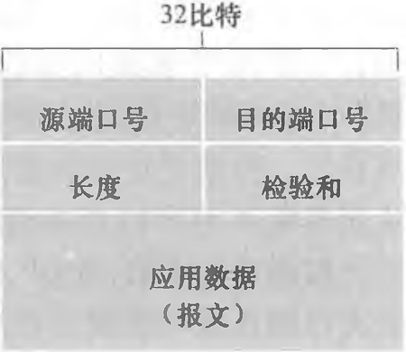

---
aliases:
tags:
  - 计算机网络
date created: 2023-09-19 二 04:02:03
date modified: 2023-10-27 五 10:25:30
---

# Link

---

Previous: [传输层](传输层.md)

Next: [TCP](TCP.md)

# UDP

---

## 和 TCP 相比

- 无连接：任何时刻都可以发送数据，无需等待建立连接，没有拥塞控制。不需要维护连接状态。
- 报文段首部开销小，UDP 报文段首部大小 8B，TCP 需要 20B。
- 用于一对一，一对多，多对多场景
- 流式媒体传输，DNS，SNMP 基于 UDP

## 报文段结构

- 首部长度为：8B。
- 源端口号：16bit。需要对方回信时用到，不需要时可填写全 0。
- 目的端口号：16bit。
- 长度：16bit。整个报文段的长度。
- 检验和：16bit。见下。

## 检验和

添加伪首部，若数据部分不是偶数字节数，则添加一个全零字节。将每 16 个 bit 求和并截断在 16bit，最后取反得到检验和。

若检验和与求和结果相机结果不为全 1，说明出现差错。出错的数据将被丢弃或向上层报告。

# Relative

---

[传输层](传输层.md)

[TCP](TCP.md)

# Reference

---
